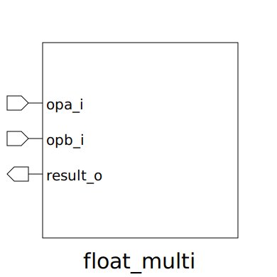

# float_multi (module)

### Author : Foez Ahmed (foez.official@gmail.com)

## TOP IO

## Description

The `float_multi` module performs floating-point multiplication. It takes two input operands
(`opa_i` and `opb_i`) and produces the result (`result_o`). The module supports customizable
floating-point formats through the `fp_t` parameter.

## Parameters
|Name|Type|Dimension|Default Value|Description|
|-|-|-|-|-|
|fp_t|type||fp_pkg::fp16_t|The floating-point type (default is `fp_pkg::fp16_t`)|

## Ports
|Name|Direction|Type|Dimension|Description|
|-|-|-|-|-|
|opa_i|input|fp_t||First operand (floating-point value)|
|opb_i|input|fp_t||Second operand (floating-point value)|
|result_o|output|fp_t||Result of the multiplication (floating-point value)|
